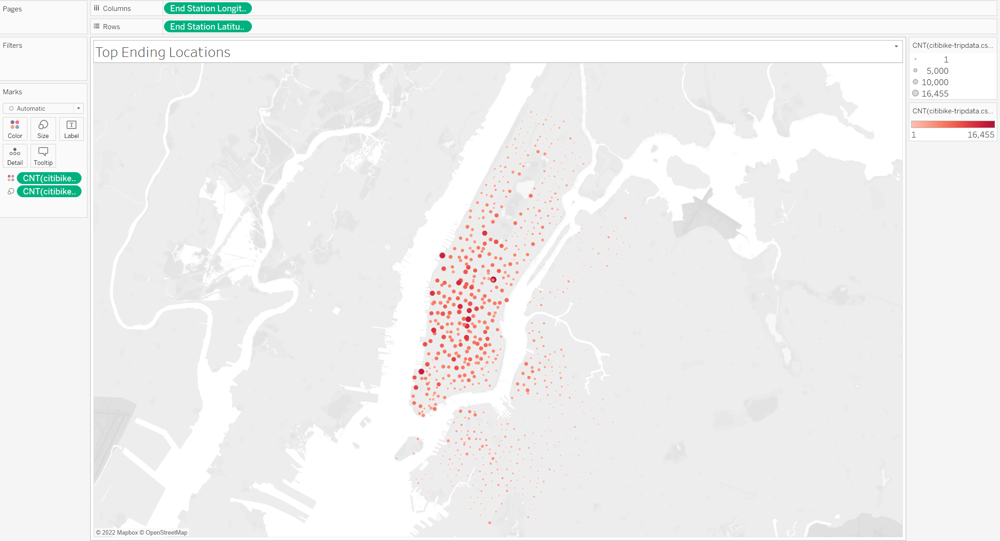

# Bike Sharing

I used Tableau worksheets to analyze how effective a bike sharing program is in New York City in order to determine whether or not to start a new bike sharing program in a smaller city such as Des Moines, Iowa. These vizualizations are included below.

Check Out Time for Users

Check Out Time for Users by Gender

Trips by Weekday Per Hour

Trips by Weekday Per Hour by Gender

Trips by Gender by Weekday

Top Starting Locations

Top Ending Locations

## Summary of Tableau Story

Link: [linktoTableau](https://public.tableau.com/views/BikeSharing_16593140311920/BikeSharing-NewYorkCity?:language=en-US&publish=yes&:display_count=n&:origin=viz_share_link)

Key take-aways of these visualizations:
- The gender most likely to use the services are males
- Bike utilization spikes between 6am-9am and 4pm-7pm during the week
- Bike utilization is high throughout the daytime on weekends
- Start and end locations indicate utilization is high in the Central Business District
- Bike utilization tapers off towards the outskirts of the city

Based on this information, if a bike sharing program were to work in a smaller city such as Des Moines, Iowa, it is recommended to place the bikes near the CBD or oustide of residential buildings surrounding the CBD. This will ensure high utilization by commuters. 
